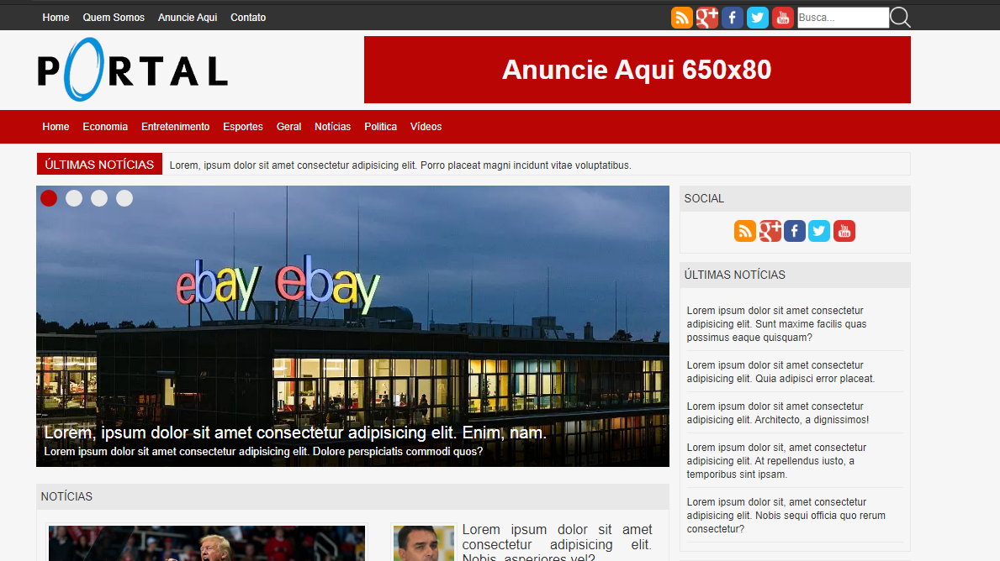

<h1 align="center">
  Portal Web HTML5
</h1>

## 📋 Índice

- [Preview](#-Preview)
- [Sobre](#-Sobre)
- [Tecnologias utilizadas](#-Tecnologias-utilizadas)
- [Como executar o projeto](#-Como-executar-o-projeto)

---

## 🖥 Preview

  

---

## 📖 Sobre 

Este site foi desenvolvido com o intuito de recriar o layout de um portal de notícias assim testando os conhecimentos adquiridos de HTML5 e CSS3 durante os cursos de desenvolvimento da B7Web com o professor Bonieky Lacerda. 

---

## 🚀 Tecnologias utilizadas
O projeto está sendo desenvolvido com as seguintes tecnologias:
- HTML
- CSS
- JavaScript

---

## ⌨ Como executar o projeto

Baixe o arquivo .ZIP do projeto e após descompactar abra o arquivo index.html

---
